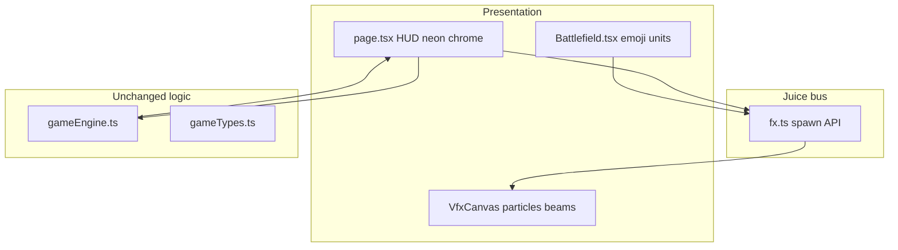

# Port PieTD Look/Feel onto Twin Bastions

**Assumption:** Twin Bastions rules stay (two bastions, layers, 1s tick, Repair/Fire/Transfer/Boost). PieTD ([PieTD/pages/game.tsx](file:///Users/vegeta/realcode/writers-forge/PieTD/pages/game.tsx)) is the **visual/audio reference**, not a gameplay conversion. No grid path, no 6-tower shop, no gold/waves/combo economy.

**Why hybrid, not full canvas:** Twin Bastions is already a spatial tableau (left/right towers, approaching Colossi). Rebuilding it as a 25×25 canvas TD would throw away the game. PieTD juice (particles, beams, floating text) is canvas-native, so a **pointer-events-none canvas overlay** sits on the existing DOM field.

## Visual language (copy from PieTD)

| Token | Value |
|-------|--------|
| Neon accent | `#00ff41` (titles, borders, CTAs, selected) |
| Page/field gradient | `#1a1a2e` → `#16213e` → `#0f1419` |
| Gold / resources | `#ffd700` |
| Score | `#00ccff` |
| Danger | `#ff4444` |
| Hero/magenta | `#ff00ff` (Beta / transfer) |
| Combo/jackpot | `#ffaa00` (phase timer / big events) |
| Font | Arial / sans-serif (PieTD has no custom font) |
| Health bars | green → yellow → red at 60% / 30% |

**Not copied:** PieTD 150ms sim loop, BTD placement preview, Viper Lord, jackpot gold.

## Architecture

### 1. Shared field layout helper

Today Colossus screen math is trapped in `ColossusOnField` ([Battlefield.tsx](src/components/Battlefield.tsx) ~173–185). VFX cannot aim Fire beams without it.

Add [src/lib/fieldLayout.ts](src/lib/fieldLayout.ts):

- `towerAnchor(side)` → `{ leftPct, bottomPct }` matching current `left-[6–10%]` / `right-[6–10%]` / `bottom-[12%]`
- `colossusAnchor(colossus, index)` → same `leftPct` / `bottomPct` / `scale` formulas already in `ColossusOnField`

Battlefield and VFX both import this. One formula, two consumers.

### 2. Canvas VFX overlay (new)

New [src/lib/fx.ts](src/lib/fx.ts) + [src/components/VfxCanvas.tsx](src/components/VfxCanvas.tsx).

Port PieTD particle loop (~16ms): velocity, drag `0.98`, gravity on explosions `+0.2`, life fade.

| Event (UI, after engine returns) | VFX | Shake | Flash |
|----------------------------------|-----|-------|-------|
| Fire hit | projectile trail bastion → colossus + explosion | 8 | 1.5 |
| Fire kill | jackpot particles (15–30, life 120) | 12 | 2 |
| Colossus damages layer (`tick` HP drop) | explosion on bastion | 3 | — |
| Layer destroyed | bigger explosion | 8 | 1.5 |
| Repair | magic `#aa44ff` / gold `#ffd700` on layer | — | 1.3 |
| Transfer | cyan/magenta beam A↔B | — | — |
| Boost | gold burst on bastion | — | 1.3 |
| Assault start | red flash | 5 | 1.5 |
| Victory | jackpot + fanfare | 15 | 2.5 |
| Defeat | red flash | 15 | 2 |

Shake/flash apply to a wrapper around Battlefield + VfxCanvas (PieTD: random `translate ± intensity` for 300ms; `brightness(1+i) saturate(1+i*0.5)` for 200ms).

Floating text: `+score`, `HIT`, `DESTROYED`, `REPAIRED`, `LAYER LOST`, `ASSAULT`, duration **2000ms**, rise + fade.

**Null path:** Fire with no target (`fireWeapons` logs “No active Colossus”) → no projectile, no shake. Afford-fail (disabled buttons) stays silent. **Missing today:** `sounds.hit` / `sounds.tick` never called — wire `hit` on layer HP drop.

Do **not** put particles in `GameState`. Keep a module-level or ref-backed FX store so the 1s game tick does not hitch the 16ms particle loop.

### 3. Juice data flow (no engine API change)

`page.tsx` already diffs phase / colossus destroyed / layer destroyed. Extend that:

| Origin | Hop | Destination |
|--------|-----|-------------|
| `handleFire` computes `next = fireWeapons(s, id)` then `setState(next)` | compare `next.colossi` vs `state.colossi` HP | `fx.projectile` + `sounds.fire` or skip if no HP change |
| `tick()` via interval | compare layer HP / destroyed flags (existing refs) | `fx.hit` / `sounds.hit` / `sounds.layerLost` |
| `handleRepair` / `transfer` / `boost` | only if returned state actually spent resources | matching FX + SFX |

**Risky if skipped:** calling FX before checking engine no-ops (e.g. fire with 0 energy is already disabled in HUD, but Transfer with 0 energy on source still early-returns in engine — must compare energy before spawning beam).

Engine files ([gameEngine.ts](src/lib/gameEngine.ts), [gameTypes.ts](src/lib/gameTypes.ts)) stay unchanged unless a compare is unverifiable — then a tiny `{ ...state, lastEvent }` would be a last resort; prefer client-side diff.

## File-level work

### Theme

[tailwind.config.ts](tailwind.config.ts) — replace unused slate-blue `bastion.*` with PieTD tokens:

- `bastion.dark` `#0a0a0a` / `panel` `#1a1a2e` / `accent` `#00ff41` / `gold` `#ffd700` / `score` `#00ccff` / `danger` `#ff4444` / `colossus` `#8800ff`

[globals.css](src/app/globals.css) — PieTD keyframes (`glow` 2s/3s neon box-shadow, `pulse` for combo-like HUD, hover `scale(1.05)`). Retarget assault/pause pulses to neon red / `#00ff41`. Delete unused leftovers (`.bg-grid`, `.log-entry`, `.tower-selected`, `.hp-bar`) **or** revive `.bg-grid` as a faint `#00ff41` 12% grid on the field.

[layout.tsx](src/app/layout.tsx) — `font-family: Arial, sans-serif`.

### HUD ([page.tsx](src/app/page.tsx))

Restyle to PieTD chrome, keep handlers:

- Title: neon glow `Twin Bastions` (keep name; PieTD emoji optional e.g. 🏰)
- HUD stats like PieTD row: Phase / Timer / Score (`#00ccff`) / Res (`#ffd700`) / selected bastion lives-style (core HP)
- Action buttons: selected fills with action color; hover scale 1.05; neon border
- Start overlay: PieTD landing vibe (gradient, glow title, feature blurb, big `#00ff41` CTA “INITIALIZE”)
- End overlay: PieTD-style fullscreen; victory gold / defeat `#ff4444`
- **Sound toggle** `🔊 SOUND` like PieTD (on/off floating notice)

Keyboard polish (PieTD has 1–6): `1`/`2` select A/B; `QWER` Repair/Fire/Transfer/Boost when enabled.

### Battlefield ([Battlefield.tsx](src/components/Battlefield.tsx))

- Background: PieTD diagonal gradient + optional neon grid
- Canvas border treatment on the field: `3px solid #00ff41`, `box-shadow: 0 0 20px rgba(0,255,65,0.3)`, CSS `glow` 3s
- Towers: colored circle + emoji (e.g. 🏰 / 🛡️) + stacked neon layer rings; selected = dashed range-style ring in bastion color (Alpha `#0066ff`, Beta `#ff00ff`)
- Colossi: circle + emoji (👾 / 👑 by name) + PieTD health bar; attacking = red `shadowBlur`; reconfiguring = cyan status ring `#00ccff`
- Nexus: neon node, not slate pill

### Audio ([sounds.ts](src/lib/sounds.ts))

Keep named API (`sounds.fire` etc.) so call sites stay. Rewrite synth bodies to PieTD recipes:

| Twin Bastions event | PieTD recipe |
|---------------------|--------------|
| `fire` | `cannon` (noise + 100Hz saw) |
| `repair` | `frost` / `mage` arpeggio |
| `boost` | `upgrade` (800→1000→1200 triangle) |
| `transfer` | `place` two-square + rising sines |
| `destroyColossus` | `jackpot` + `enemy_death` |
| `layerLost` | `enemy_death` lower |
| `victory` | C–E–G–C triangle, 150ms |
| `select` / `click` | `place` clicks |
| mute | `enabled` flag + `toggle()` like PieTD `SoundEngine` |

No audio files. Resume `AudioContext` on first gesture (start button already does this).

### Docs

No `docs/` folder. Update README “Visuals & Audio” so it matches the new field + VFX overlay (current README still describes old cards/silhouettes).

## Out of scope

- Changing tick rate, spawn tables, costs, victory conditions
- Copying PieTD as a second game mode
- Image/sprite assets, BGM loop
- Showing `state.log` (still unused; not required for PieTD look)
- Wiring `tunnelStatus` (engine never sets `contested`/`collapsed`)
